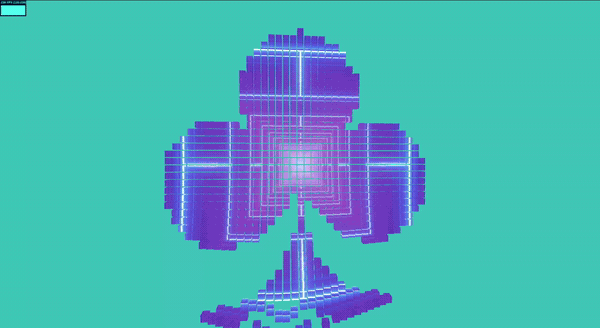

# Demo at - WIP



## Features / What We've Learned

### 1. **UV Projection Map**

- Split individual geometries to take a slice of a texture as its material

### 2. **Shape Projection Grid With Unicode Text in Canvas**

### 3. **Raycasting Cursor for Grid Cells to Follow**

- Recalculate positioning of each cell compared to distance to mouse cursor

## Todos

### 1. **InstancedMeshed**

- Ok we tried this but actually ended up being much more complex since there is no native "current" dummy instance position to track in the raycasting logic. Ended up having to store and track this every frame and update and ended up being more work for performance we won't see

### 2. **Shader UV Mapping**

- Make the material a shaderMaterial and map texture here

### 3. **Other Performance**

- Anything to get more fps, but we're using gridSize and creating a new geometry / mesh in each nested loop to create the grid. Might have to revisit instancedMeshes at some point but it's not too bad currently

---

## Installation

### Prerequisites

- Node.js (v16 or higher)
- npm or yarn

### Steps

1. Clone the repository:

    ```bash
    git clone <repository-url>
    ```

2. Navigate to the project directory:

    ```bash
    cd <project-directory>
    ```

3. Install dependencies:

    ```bash
    npm install
    # or
    yarn install
    ```

4. Start the development server:

    ```bash
    npm run dev
    # or
    yarn dev
    ```

---
