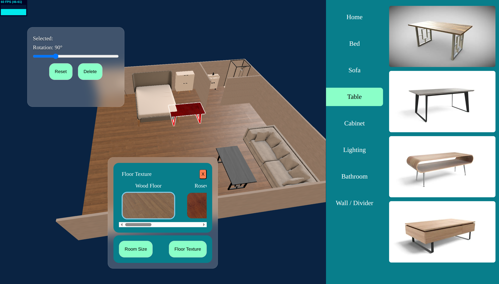

## Room Configurator

- Interactive 3D models loading with Three.js and use raycasting drag controls to position them anywhere in your room.

### All components functionally working, just need to make it pretty and deployed



---

### Todos:

- Style UIs more
- Fix bug with slight model jumping when first moved
- Fill in decorational models ( tv, plants, lego sets etc )

---

## Installation

### Prerequisites

- Node.js (v16 or higher)
- npm or yarn

### Steps

1. Clone the repository:

    ```bash
    git clone <repository-url>
    ```

2. Navigate to the project directory:

    ```bash
    cd <project-directory>
    ```

3. Install dependencies:

    ```bash
    npm install
    # or
    yarn install
    ```

4. Start the development server:

    ```bash
    npm run dev
    # or
    yarn dev
    ```

---
